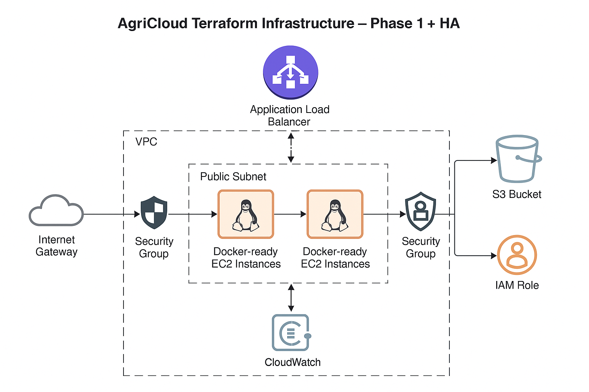

# 🌿 AgriCloud – Terraform AWS Infrastructure

This project sets up the foundational **AWS infrastructure** for an agritech platform using **Terraform**. It aims to support an AI-powered system for monitoring soil, water, temperature, and plant health — starting with coffee farms.

---

## 🖼️ Infrastructure Diagram



## 🚀 Objective (Phase 1)

Provision the following infrastructure components with Terraform:

- ✅ Virtual Private Cloud (VPC)
- ✅ Public & Private Subnets
- ✅ Internet & NAT Gateways
- ✅ Route Tables & Associations
- ✅ Security Groups (SSH, HTTP)
- ✅ EC2 Instance (Docker-ready)
- ✅ S3 Bucket (for data storage/logs)
- ✅ IAM Role for EC2 access
- ✅ CloudWatch Agent (optional future step)
- ✅ Application Load Balancer (ALB) for traffic distribution
- ✅ Auto Scaling Group (ASG) for failover

---

## 🧱 Tech Stack

| Tool      | Purpose                       |
| --------- | ----------------------------- |
| Terraform | Infrastructure as Code (IaC)  |
| AWS       | Cloud Provider                |
| EC2       | Compute (for AI/API services) |
| S3        | Object Storage                |
| IAM       | Access Control                |
| VPC       | Networking                    |
| ALB       | Load Balancing                |
| ASG       | Self-healing & scaling        |

---

## 📁 Project Structure

```bash
terraform-agricloud/
├── main.tf              # Core infrastructure: VPC, EC2, S3, SGs, ALB, ASG
├── variables.tf         # All input variables with types/defaults
├── outputs.tf           # Outputs like EC2 IP, S3 bucket name
├── terraform.tfvars     # Environment-specific values (ignored by Git)
├── provider.tf          # AWS provider and region config
├── backend.tf           # (Optional) Remote state config (e.g., S3)
└── README.md            # Project overview and usage
```

---

## 🛡️ Safe Mode: Free Tier-Friendly Terraform Setup

This project is designed to be safely cloned and deployed by beginners or learners using the **AWS Free Tier**. It provisions minimal resources that stay within the free limits provided by AWS to avoid unexpected charges.

### ✅ Why It's Safe:

- **Stays within AWS Free Tier limits**
- **Uses only free-tier eligible services**
- **Can be fully destroyed after use**
- **Ideal for beginner Terraform + AWS testing**

### 🧱 What This Setup Creates:

| Resource             | Description                                   |
| -------------------- | --------------------------------------------- |
| **VPC**              | Custom virtual network (free)                 |
| **Public Subnet**    | Hosts the EC2 instance                        |
| **EC2 Instance**     | `t2.micro` or `t3.micro` (free-tier eligible) |
| **Security Group**   | SSH (port 22) access only                     |
| **Internet Gateway** | For public internet access to EC2             |

### ❌ What It Avoids:

- ❌ No NAT Gateway (which incurs cost)
- ❌ No additional EBS volumes
- ❌ No data transfer-heavy services

### 🧼 Clean-Up Reminder

Always run the following command to **destroy all resources and avoid billing**:

```bash
terraform destroy -var-file="terraform.tfvars"
```

This ensures a full teardown of all provisioned infrastructure.

> ℹ️ You still need a valid AWS account with Free Tier eligibility and an existing EC2 key pair.

---

## 🛎️ Usage

1. **Initialize Terraform:**

   ```bash
   terraform init
   ```

2. **Plan the deployment:**

   ```bash
   terraform plan -var-file="terraform.tfvars"
   ```

3. **Apply the configuration:**

   ```bash
   terraform apply -var-file="terraform.tfvars"
   ```

---

## 📌 Author

**Juzantino Junadi**
Cloud Engineer | Full Stack Developer | AI/IoT Enthusiast
